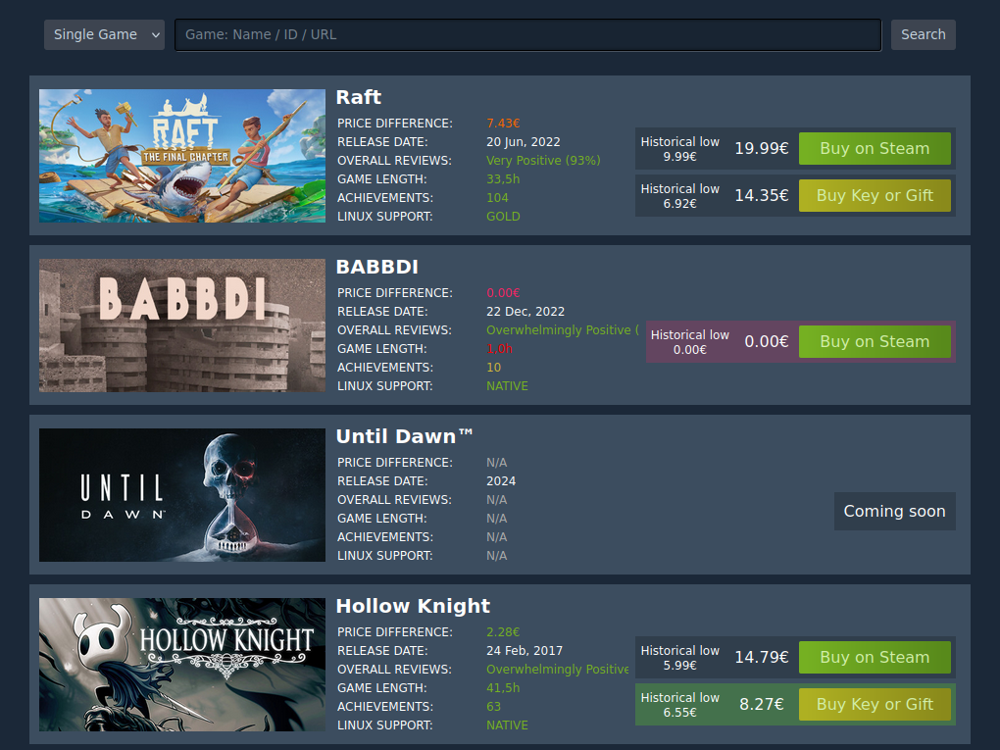

# Steam Details

Displays some details for a steam app or a whole wishlist.

Written to be used in the european union and tested in germany. If should be easy to modify this project to work in other countries if necessary.

## Disclaimer

This project is NOT affiliated with Steam. It is only for educational purposes.

## Showcase

You can hover over almost anything to see more details.



## Installation

```bash
git clone https://github.com/dodaucy/steam-details.git
cd steam-details

python3 -m pip install -Ur requirements.txt
```

## Usage

```bash
python3 -m uvicorn main:app --host 127.0.0.1 --port 8000
```
